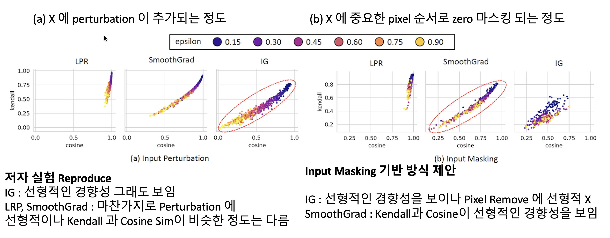

# SmoothGrad has Better Kendall's Rank for Removed Pixels


🔖 Check out the result in [paper](assets/paper.pdf)


### Experiment Description

In this experiment, we demonstrate that the Kendall's rank correlation on input attributions and cosine similarity has 
strictly linear correlation only for the Integrated Gradient. However, other input attribution methods (LRP and SmoothGrad) also exhibits positive correlation. 

In addition, we propose attribution score based input masking for the input deviation for the alternative of input perturbation. 
We empircially show that masking based deviation has strictly positive correlation for SmoothGrad while IG fails. 




### Menu Script

```bash 
# first train cnn models with CIFAR10 dataset
bash run.py

# run jupyter notebook kendall_cosine.iypnb
```

## Abstract 

Evaluating the input attributions of Deep Neural Network (DNN) is crucial for explanation of a black-box model. Recent work shows that the Integrated Gradients shows positive correlation for Kendall's rank correlation and cosine similarity with the perturbed input. However, input perturbation is a unclear baseline for the deviation of input. For example, SmoothGrad has already considers the input perturbation in its computation. To properly measure the input deviation, we propose masking based input deviation. We show that SmoothGrad and LRP has positive correlation with masked input, while IG fails to construct the strictly positive correlation. 


### Contact / Credits 

* bumjin@kaist.ac.kr 