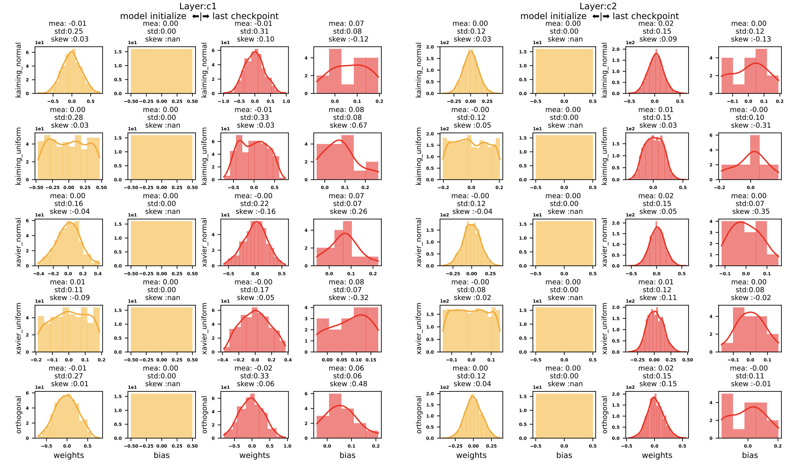
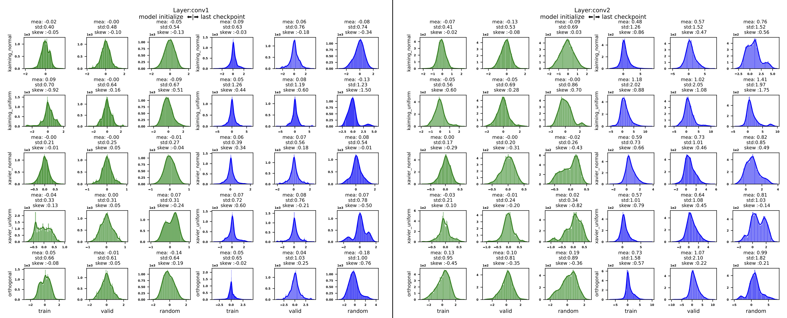
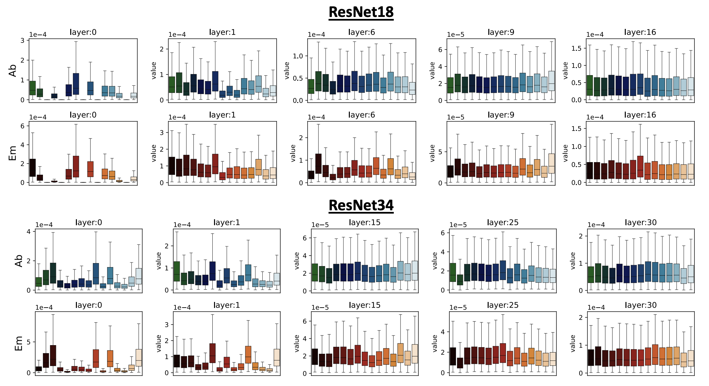

# 🔖 Check out the result in format [paper](paper.pdf)

---

## Abstract 

The deep neural network is intractable to be analyzed as the number of parameters is huge and the training dynamics are stochastic. Despite the existence of difficulty, it is necessary to analyze the internal representation space for the debugging of models.  In this work, we present the empirical results in distribution shifts of parameters and features of deep neural networks with several weight initialization methods. As the result we found that the mean of parameters is almost centered at zero while the variance increased for all layers after the training. In the case of features, they had higher variance for  deeper layer compared to lower layers. In addition we analyze the gradients on the convolution features with mathematical formulation and present two statistics: emission and absorption of gradients for a single channel. The empirical result show that each channel has different variance of emission and absorption even in the same layer. 


# 1. Distribution Analysis - initialization test


Goal : Visualize the distribtuion of features for CNN and gradients in the convolution layers. 

Features 
1. various initialization techniques are used 
   * Kaiming Normal
   * Kaiming Uniform 
   * Xavier Normal
   * Xavier Uniform 
   * Orthogonal
   * Ones 
   * Zeros
2. Compare the initial and the final trained CNN on CIFAR10. 
    See [model.py](src/model.py) for model descript


---

We give the weight distribtuion before and after training for various initialization schemes



---

We also give the feature distribtuion before and after training for various initialization schemes and input types



### Reproduce the results 

```bash 
# step 1
cd initialization_test
bash shell/train.sh 

# step 2
bash shell/feature.sh 

# step 3 
Run the notebook
```


# 2. Channel statistics 

Gradient is the tool to analyze the behavior of a model. 

We define two types of gradient statistics for a channel 

* *Absoprtion* : How much gradient comes to the channel?
* *Emission* : How much gradient goes out from the channel?

---

We give the *Ab* and *Em* of ResNet models  pretrained on ImageNet1K




### Reproduce the results 


```bash
cd channel_gradients 
# step 1
bash run_all.sh

# step 2
Run the notebook

```


### Contact / Credits 

* bumjin@kaist.ac.kr 