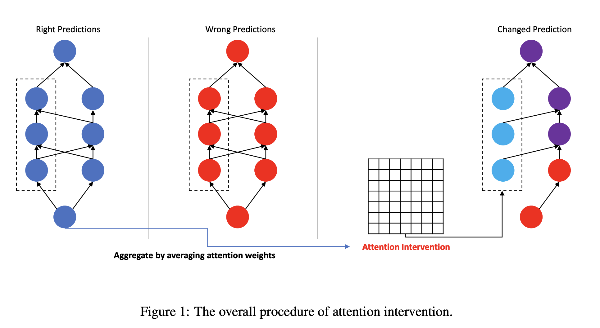

# 🔖 Check out the result in format [paper](paper.pdf)

## Abstract 

Pre-trained language models have led to recent success in various NLP tasks. Although there have been many efforts to analyze what linguistic properties are learned inside, how they are used for prediction is still unclear. In this work, we propose a way to analyze whether attention patterns encode syntactic knowledge or not. Specifically, we intervene attention weights to correct wrong predictions. We test the proposed method with the BERT base model on natural language inference tasks. The experimental results show that our method substantially improves the performance on a challenge set without additional training. This implies that attention weights play an important role in carrying syntactic knowledge

### Contact / Credits 

* cw.kang@kaist.ac.kr 