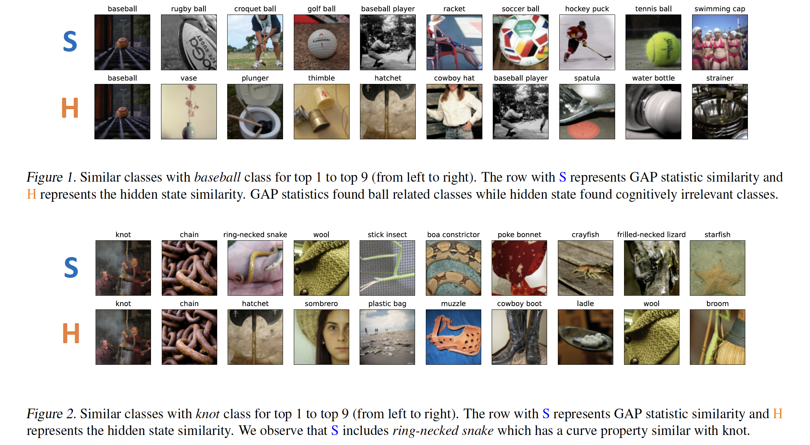

🔖 Check out the result in format [paper](paper.pdf)

## Abstract 

For the reliability of a complex deep neural network, explanation on the decision is necessary. Despite the complexity of a model, many researchers have found ways to explain the decision. Recently, conformity score is used to make a prediction set for labels and provides more information about predictions. However, finding the label based on the classification probabilities has a limitation on the comparison as (1) the output space of the model is very compact and (2) the decision process is not considered. As an alternate way to provide similar labels with the prediction, we apply statistical significance on finding similar labels with the prediction class.  We empirically find top-k similar classes with ResNet34 and ImageNet1k dataset and verify that our method coincides with the cognitive process of a human who finds concepts of images. 

### Contact / Credits 

* bumjin@kaist.ac.kr 